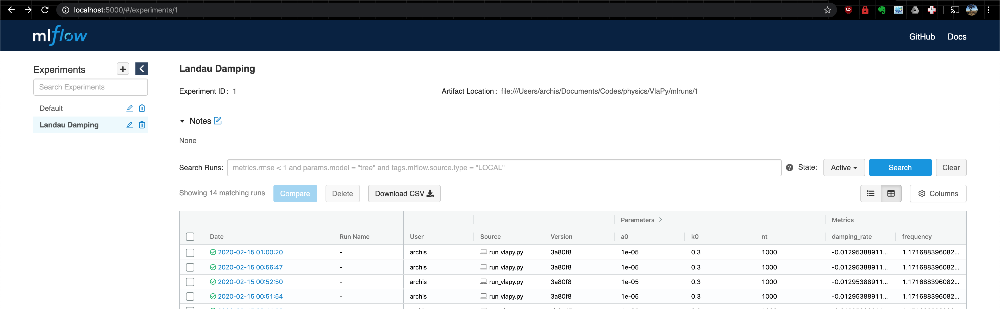

.. VlaPy documentation master file, created by
   sphinx-quickstart on Sun Mar 29 08:24:59 2020.
   You can adapt this file completely to your liking, but it should at least
   contain the root `toctree` directive.

Welcome to VlaPy!
=================================

Overview
---------
VlaPy is a 1-spatial-dimension, 1-velocity-dimension, Vlasov-Poisson-Fokker-Planck code written in Python.
The Vlasov-Poisson-Fokker-Planck system of equations is commonly used in plasma physics.

Quick Usage
-----------
To install dependencies, run ``python3 setup.py install`` from the base directory of the repository.

After this step, ``python3 run_vlapy.py`` can be executed to run a simulation of Landau damping with collisions.

This will create a temporary directory for the simulation files. Once completed, MLFlow will move the simulation folder
into a centralized datastore. This datastore can be accessed through a web-browser based UI provided by leveraging MLFlow.

To start the MLFlow UI server, type ``mlflow ui`` into the terminal and then navigate to ``localhost:5000`` in your
web browser. The page will look like the following

Implementation
------------------

Details on the implementation are given in the following pages

.. toctree::
   :maxdepth: 2

   usage_details
   vlasov
   fokker-planck
   electricfield
   definitions
   other
   code

Contribution
---------------
If you would like to contribute, please raise an issue in the GitHub repository using the issue tracker. The repository
is located at https://github.com/joglekara/vlapy.

...this page is in development...

Indices and tables
==================

* :ref:`genindex`
* :ref:`modindex`
* :ref:`search`
