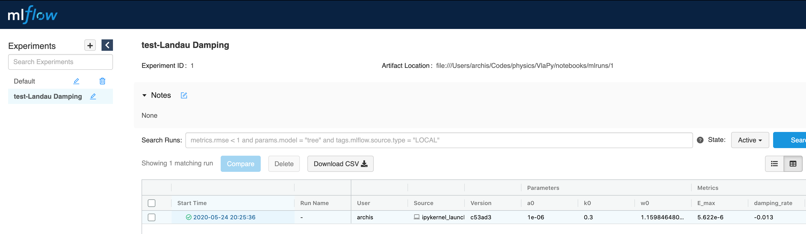
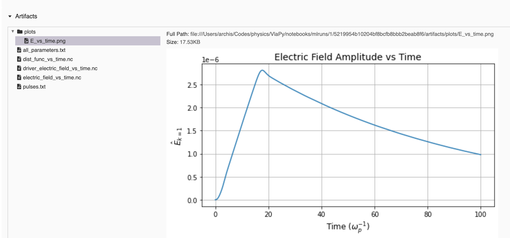

# Summary

Here we introduce ``VlaPy``: a 1-spatial-dimension, 1-velocity-dimension (1D-1V), Eulerian Vlasov-Poisson-Fokker-Planck (VPFP) simulation code written in Python.  

The Vlasov-Poisson-Fokker-Planck system of equations is commonly used to study plasma and fluid physics in a broad set of topical environments, ranging from space physics, to laboratory-created plasmas for fusion applications (see [@Betti2016; @Fasoli2016; @Ongena2016; @Chen2019]). More specifically, the Vlasov-Poisson system of equations is typically employed to model collisionless plasmas. The Fokker-Planck operator can be introduced into this system to represent the effect of collisions. The primary advantage of this scheme is that instead of relying on numerical diffusion to smooth small-scale structures that arise when modeling collisionless plasmas, the Fokker-Planck operator enables a physics-based smoothing mechanism. 

Our implementation is based on finite-difference and pseudo-spectral methods. At the lowest level, ``VlaPy`` evolves a two-dimensional (2D) grid according to this set of coupled partial integro-differential equations over time. In ``VlaPy``, the simulation dynamics can be initialized through user-specified initial conditions or external forces.

# Statement of Need

The 1D-1V VPFP equation set solved here has been applied in research of laser-plasma interactions in the context of inertial fusion [@Fahlen2009; @Banks2016], of plasma-based accelerators [@Thomas2016], of space physics [@Chen2019], and of fundamental plasma physics [@Pezzi2016; @Heninger2018].  While there are VPFP software libraries which are available in academic settings, research laboratories, and industry (e.g., [@Banks2017; @Joglekar2018]), the community has yet to benefit from a simple-to-read, open-source Python implementation. This lack of capability is currently echoed in conversations within the ``PlasmaPy`` [@plasmapy] community (``PlasmaPy`` is a collection of open-source plasma physics resources). Our aim with ``VlaPy`` is to take a step towards filling this need for a research and educational tool in the open-source community.

``VlaPy`` is intended to help students learn fundamental concepts and help researchers discover novel physics and applications in plasma physics, fluid physics, computational physics, and numerical methods.  It is also designed to provide a science-accessible introduction to industry and software engineering best-practices, including unit and integrated testing, and extensible and maintainable code. 

The details of the ``VlaPy`` implementation are provided in the following sections. 

# Equations

The Vlasov-Poisson-Fokker-Planck system can be decomposed into 4 components. These components, represented using normalized units, are 
$\tilde{v} = v/v_{th}$, $\tilde{t} = t / \omega_p$, $\tilde{x} = x / (v_{th} / \omega_p)$, $\tilde{m} = m / m_e$, $\tilde{E} = e E / m_e$, $\tilde{f} = f / m_e n_e v_{th}^3$. 
where $v_{th}$ is the thermal velocity, $\omega_p$ is the electron plasma frequency, $m_e$ is the electron mass, and $e$ is the electron charge. 
The Fourier transform operator is represented by $\mathcal{F}$ and the subscript to the operator indicates the dimension of the transform. 
 

## Vlasov Equation

The normalized, non-relativistic ($\gamma=1$) Vlasov equation is given by
$$ \frac{\partial f}{\partial t} + v  \frac{\partial f}{\partial x} - E(x) \frac{\partial f}{\partial v} = 0, $$

where $f = f(x,v,t)$ is the electron velocity distribution function.

We use operator splitting to advance the time-step [@Crouseilles2015]. Each one of those operators is then integrated pseudo-spectrally using the following methodology.

We use the Fourier expansions of the distribution function, which are given by
$$f(x_l,v_j) = \sum \hat{f_x}(k_x, v_j) \exp(i k_x x_l) = \sum \hat{f_v}(x_l, k_v) \exp(- i k_v v_j).$$

We first discretize $f(x,v,t) = f^n(x_l, v_j)$, and then perform a Fourier expansion in $\hat{x}$ for each grid value of $v$. 

This gives

$$ f^n(x_l, v_j) = \sum \hat{f}_x(k_x, v_j) \exp(i k_x x_j) $$

which is substituted into the Fourier transform of the advection operator in $\hat{x}$, as given by 
$$ \mathcal{F}_x\left[ \frac{\partial f}{\partial t} = - v \frac{\partial f}{\partial x} \right].$$

This process enables the decoupling of $\hat{x}$ and $\hat{v}$ grids from the time dimension and allows us to write an Ordinary Differential Equation in time for the discretized distribution function $\hat{f_x}^n(k_x, v_j)$. This is given by 

$$\frac{d \left[\hat{f_x}^n (k_x, v_j) \right]}{\hat{f_x}^n (k_x, v_j)} = -v_j~ (i k_x)~ dt. $$

Next, we solve for the change in the plasma distribution function, integrate in time, and evaluate the integral at $\hat{f_x}^n$ and $\hat{f_x}^{n+1}$ which gives

$$ \hat{f_x}^{n+1}(k_x, v_j) = \exp(-i k_x ~ v_j \Delta t) ~~ \hat{f_x}^n(k_x, v_j). $$ 

The $E \partial f/\partial v$ term is evolved similarly using
$$ \hat{f_v}^{n+1}(x_l, k_v) = \exp(-i k_v ~ F_l \Delta t) ~~ \hat{f_v}^n(x_l, k_v). $$

We have implemented a simple Leapfrog scheme as well as a 4th order integrator called the 
Position-Extended-Forest-Ruth-Like Algorithm (PEFRL) [@Omelyan2002]

### Tests
The implementation of this equation is tested in the integrated tests section.

## Poisson Equation

The normalized Poisson equation is simply
$$  \nabla^2 \Phi = - \rho $$

Because the ion species are effectively static and form a charge-neutralizing background to the electron dynamics, we can express the Poisson equation as
$$ - \nabla E = - \rho_{net} = -(1 - \rho_e) $$ 

This is justifed by the assumption that the relevant time-scales are short compared to the time-scale associated to ion motion.

In 1 spatial dimension, this can be expressed as

$$ \frac{\partial}{\partial x} E(x) = 1 - \int f(x,v) ~dv $$

and the discretized version that is solved is

$$  E(x_i)^{n+1} = \mathcal{F}_x^{-1}\left[\frac{\mathcal{F}_x\left(\sum_j f^n(x_i,v_j) \Delta v\right)}{- i k_x}\right] $$

### Integrated Code Testing
Unit tests are provided for this operator to validate its performance and operation under the above assumptions. These are simply unit tests against analytical solutions of integrals of periodic functions. They can be found in 
`tests/test_fieldsolver.py`.

Below, we provide an example illustration of this validation. The code is provided in 
`notebooks/test_poisson.ipynb`

## Fokker-Planck Equation

We have implemented two simplified versions of the full Fokker-Planck operator [@Lenard1958; @Dougherty1964]. 

The first of these implementations (LB) has the governing equation given by
$$\left(\frac{\delta f}{\delta t}\right)_{\text{coll}} = \nu \frac{\partial}{\partial v} \left( v f + v_0^2 \frac{\partial f}{\partial v}\right), $$
where 
$$v_0^2 = \int v^2 f(x,v) ~ dv, $$ 
is the thermal velocity of the distribution. 

The second of these implementations (DG) has a governing equation given by
$$\left(\frac{\delta f}{\delta t}\right)_{\text{coll}} = \nu \frac{\partial}{\partial v} \left ( (v-\underline{v}) f + v_{t}^2 \frac{\partial f}{\partial v}\right), $$
where 
$$\underline{v} = \int v f(x,v) ~ dv,$$ 
is the mean velocity of the distribution and 
$$v_{t}^2 = \int (v-\underline{v})^2 f(x,v) ~ dv, $$ 
is the thermal velocity of the shifted distribution.

The second implementation is an extension of the first, and extends momentum conservation for distributions that have a non-zero mean velocity. 

We discretize this backward-in-time, centered-in-space. This procedure results in the time-step scheme given by
$$ f^{n} = \left[LD \times \bar{v}_{j+1}f^{n+1}_{j+1} + DI \times f^{n+1}_j + UD \times \bar{v}_{j-1}f^{n+1}_{j-1}  \right]. $$
$$ LD = {\Delta t} \nu \left(-\frac{v_{0,t}^2}{\Delta v^2} + \frac{1}{2\Delta v}\right) $$
$$ DI =  -\left(1+2{\Delta t} \nu \frac{v_{0,t}^2}{\Delta v^2}\right) $$
$$ UD = {\Delta t} \nu \left(\frac{v_{0,t}^2}{\Delta v^2} + \frac{1}{2\Delta v}\right) $$
where $\bar{v} = v$ or $\bar{v} = v - \underline{v}$ depending on the implementation. 

This forms a tridiagonal system of equations that can be directly inverted.

### Integrated Code Testing
Unit tests are provided for this operator. They can be found in `tests/test_lb.py` and `tests/test_dg.py`. 
The unit tests ensure that

1. The operator does not impact a Maxwell-Boltzmann distribution already satisfying $v_{th} = v_0$.

2. The LB operator conserves number density, momentum, and energy when initialized with a zero mean velocity.

3. The DG operator conserves number density, momentum, and energy when initialized with a non-zero mean velocity.

The `notebooks/test_fokker_planck.ipynb` notebook contains illustrations and examples for these tests. Below, we show results from some of the tests for illustrative purposes. 

We see from the above figures that the distribution relaxes to a Maxwellian. Depending on the implementation, certain characteristics of momentum conservation are enforced or avoided. 

# Integrated Code Tests against Plasma Physics: Electron Plasma Waves and Landau Damping

Landau Damping is one of the most fundamental plasma physics phenomenon. An extensive review is provided in [@Ryutov1999].  

Plasmas can support electrostatic oscillations. The oscillation frequency is given by the electrostatic electron plasma wave (EPW) dispersion relation. When a wave of sufficiently small amplitude is driven at the resonant wave-number and frequency pairing, there is a resonant exchange of energy between the plasma and the electric field, and the electrons can damp the electric field. The damping rates, as well as the resonant frequencies, are given in [@Canosa1973].

In the ``VlaPy`` simulation code, we have verified that the known damping rates for Landau Damping are reproduced, for a few different wave-numbers. This is shown in `notebooks/landau_damping.ipynb`. 

We include validation against this phenomenon as an automated integrated test. The tests can be found in 
`tests/test_landau_damping.py`

Below, we also illustrate a manual validation of this phenomenon through the fully integrated workflow. After running a properly initialized simulation, we show that the damping rate of an electron plasma wave with $k=0.3$ is reproduced accurately through the UI. This can also be computed manually (please see the testing code for details).

To run the entire testing suite, make sure `pytest` is installed, and call `pytest` from the root folder for the repository. Individual files can also be run by calling `pytest tests/<test_filename>.py`.

# Acknowledgements
We use xarray [@Hoyer2017] for file storage and MLFlow [@Zaharia2018] for experiment management.

We acknowledge valuable discussions with Pierre Navarro on the implementation of the Vlasov equation.

We are grateful for the editors' and reviewers' thorough feedback that improved the software as well as manuscript.

# References
